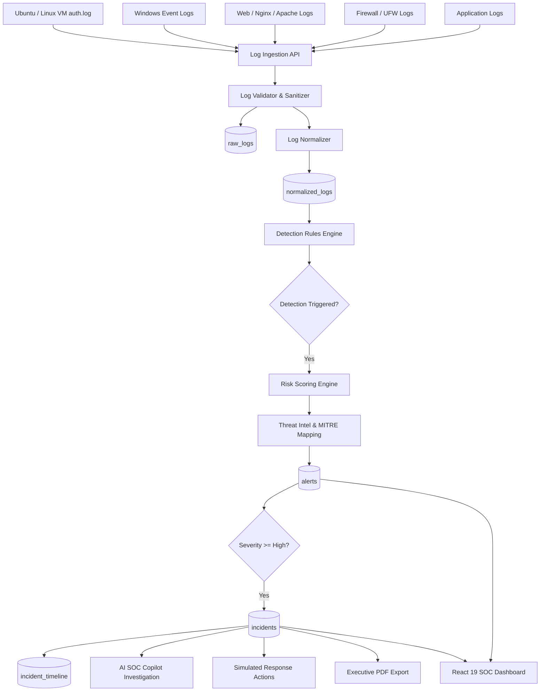

# SentinelX — Project Overview

## 1. Executive Summary

**SentinelX** is a modern Security Operations Center (SOC) and Threat Intelligence Platform engineered to ingest, normalize, detect, correlate, investigate, and simulate incident response across multi-source enterprise security telemetry in real time.

Modern security teams face overwhelming log volumes, alert fatigue, fragmented point solutions, and opaque black-box machine learning models. SentinelX addresses these challenges through:
1. **Deterministic, Explainable Detection**: Clear rule-based triggers with verified positive and negative test suites.
2. **Transparent Risk Scoring (0–100)**: A mathematically explainable formula combining severity, confidence, threat intelligence reputation, event frequency, and MITRE ATT&CK technique impact.
3. **Native MITRE ATT&CK Mapping**: Direct linkage of alerts to authentic adversary tactics and techniques.
4. **AI-Assisted Investigation**: OpenRouter integration (DeepSeek / Gemini) delivering executive summaries, root cause analyses, attack likelihood estimations, and containment playbooks.
5. **Simulated Response Actions**: Safe, auditable containment workflows (e.g., firewall IP blocking, credential resets, host isolation) recorded on an immutable incident timeline.
6. **Executive PDF Reporting**: Pixel-perfect, multi-page security incident reports generated server-side using PDFKit.

---

## 2. Core Security Philosophy

```
┌────────────────────────────────────────────────────────────────────────┐
│                        SENTINELX CORE PRINCIPLES                       │
├────────────────────────────────────────────────────────────────────────┤
│ 1. Zero Mock Data in Production: All metrics query live PostgreSQL.    │
│ 2. Explainable Detection: Every alert details why and how it triggered.│
│ 3. Fail-Safe Ingestion: Malformed telemetry is isolated without crashes│
│ 4. Audit Trail Integrity: Every status change and action is logged.   │
│ 5. Defensive Realism: Mapped against real-world adversary behaviors.   │
└────────────────────────────────────────────────────────────────────────┘
```

---

## 3. Platform Capabilities vs Scope Boundaries

To maintain technical accuracy, the table below delineates verified implementations from platform boundaries:

| Capability | SentinelX Implementation Status | Architecture Notes |
|---|---|---|
| **Multi-Source Log Ingestion** | **Implemented** | REST API (`POST /api/logs/ingest`), batching, token authentication. |
| **Log Normalization** | **Implemented** | 5 distinct parsers: Windows Events, Linux SSH, Web Server, Firewall, Application. |
| **Rule-Based Threat Detection** | **Implemented** | 6 deterministic rules (Brute Force, Port Scan, SQLi, Suspicious Login, Malware, Anomaly). |
| **Dynamic Risk Scoring** | **Implemented** | Deterministic 5-factor scoring model yielding 0–100 integer scores. |
| **Threat Intelligence Enrichment** | **Implemented** | IoC matching for IP addresses, domain names, file hashes, and CVE identifiers. |
| **MITRE ATT&CK Mapping** | **Implemented** | Mappings for T1110, T1046, T1190, T1078, T1059.001, T1070. |
| **Incident Correlation & Timeline** | **Implemented** | Automated incident creation for high/critical alerts; junction mapping; chronological audit events. |
| **AI Threat Copilot** | **Implemented** | OpenRouter chat completion API with structured JSON output enforcement. |
| **Simulated Response Actions** | **Implemented** | Lifecycle management for containment actions with execution audit. |
| **Server-Side PDF Export** | **Implemented** | Streamed multi-page reports via PDFKit with executive badges, timeline, and AI playbooks. |
| **Malware File Scanning** | **Implemented** | CLI utility invoking compiled YARA v4.5.5 rules. |
| **Real-Time Packet Sniffing (PCAP)** | **[Future / Planned]** | SentinelX ingests firewall & web logs; it does not contain a kernel promiscuous sniffer. |
| **Kernel-Level EDR Driver** | **[Future / Planned]** | Host monitoring is achieved via auth logs & Sysmon event shippers. |
| **Automated Active SOAR Blocking** | **[Future / Planned]** | Current response actions are simulated and recorded; direct firewall API hooks are planned. |

---

## 4. End-to-End High Level Flow


