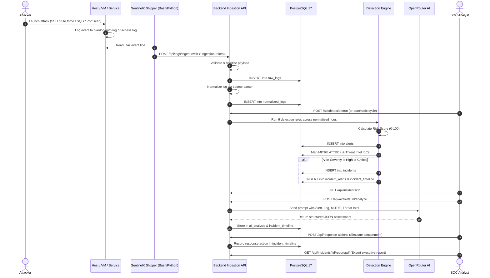
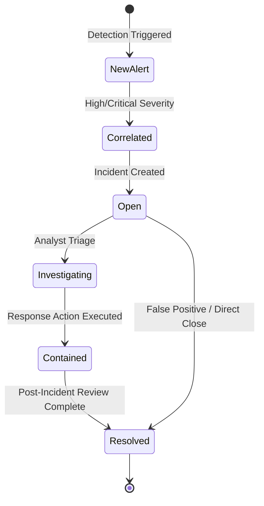

# SentinelX — System Workflow & Data Lifecycle

## 1. High-Level Telemetry Flow

The SentinelX workflow transforms raw, unstructured, multi-source log telemetry into triaged alerts, correlated incident cases, and actionable response intelligence.

---

## 2. Telemetry Ingestion Stages

### Stage 1: Ingestion
- Shippers send HTTP POST requests with single or batch log entries to `/api/logs/ingest`.
- Authentication is verified using `x-ingestion-token`.

### Stage 2: Validation & Sanitization
- `logValidator.js` validates:
  - Source type validity (`windows_event_log`, `linux_ssh`, `web_server`, `firewall`, `application`).
  - IP address formatting (RFC 791 / RFC 4291).
  - Integer ports (`1–65535`).
  - Severity mapping.
- Unsanitized fields are stripped to prevent SQL injection or schema disruption.

### Stage 3: Normalization
- Universal dispatcher `normalizeLog()` invokes the designated source parser.
- Standardized fields extracted:
  - `event_time`, `event_type`, `severity`
  - `source_ip`, `destination_ip`, `source_port`, `destination_port`
  - `username`, `hostname`, `protocol`, `action`, `message`

---

## 3. Incident Lifecycle State Machine

### Status Definitions:
- **Alert Statuses**:
  - `new`: Freshly detected, awaiting analyst acknowledgment.
  - `acknowledged`: Analyst is aware of the alert.
  - `investigating`: Under active investigation.
  - `resolved`: Addressed or marked benign.
- **Incident Statuses**:
  - `open`: Correlated case awaiting triage.
  - `investigating`: Analyst assigned, notes added, AI investigation run.
  - `contained`: Containment response actions deployed (e.g. IP block, host isolation).
  - `resolved`: Incident closed with root cause documented.
