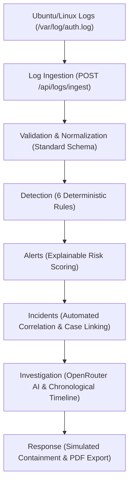
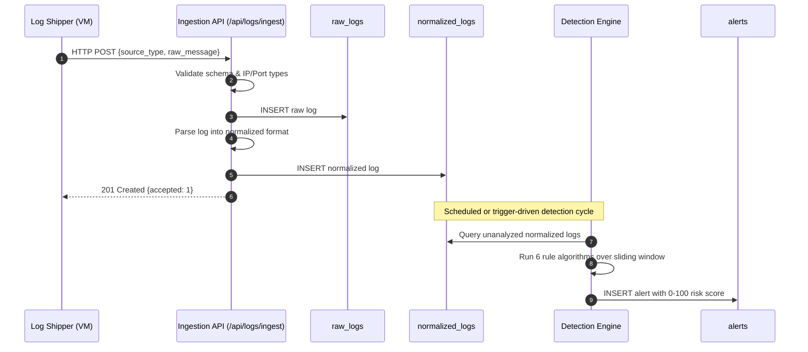

# SentinelX — Data Flow Diagram

## 1. End-to-End Telemetry Transformation Pipeline

```mermaid
flowchart TD
    A["Ubuntu/Linux Logs (/var/log/auth.log)"]
    B["Log Ingestion (POST /api/logs/ingest)"]
    C["Validation & Normalization (Standard Schema)"]
    D["Detection (6 Deterministic Rules)"]
    E["Alerts (Explainable Risk Scoring)"]
    F["Incidents (Automated Correlation & Case Linking)"]
    G["Investigation (OpenRouter AI & Chronological Timeline)"]
    H["Response (Simulated Containment & PDF Export)"]

    A --> B
    B --> C
    C --> D
    D --> E
    E --> F
    F --> G
    G --> H
```

---

## 2. Ingestion to Detection Sequence

```mermaid
sequenceDiagram
    autonumber
    participant Shipper as Log Shipper (VM)
    participant API as Ingestion API (/api/logs/ingest)
    participant RawDB as raw_logs
    participant NormDB as normalized_logs
    participant Engine as Detection Engine
    participant AlertDB as alerts

    Shipper->>API: HTTP POST {source_type, raw_message}
    API->>API: Validate schema & IP/Port types
    API->>RawDB: INSERT raw log
    API->>API: Parse log into normalized format
    API->>NormDB: INSERT normalized log
    API-->>Shipper: 201 Created {accepted: 1}

    Note over Engine,NormDB: Scheduled or trigger-driven detection cycle
    Engine->>NormDB: Query unanalyzed normalized logs
    Engine->>Engine: Run 6 rule algorithms over sliding window
    Engine->>AlertDB: INSERT alert with 0-100 risk score
```
