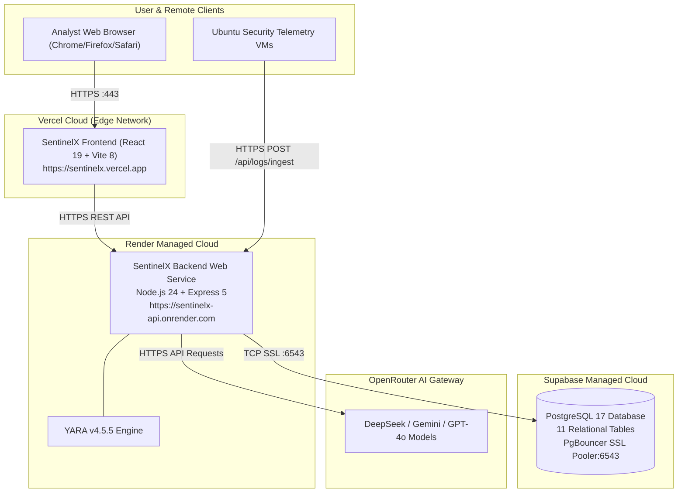

# SentinelX — Cloud Deployment Architecture Diagram

## 1. Cloud Infrastructure & Service Topology

```mermaid
graph TB
    subgraph UserClients["User & Remote Clients"]
        Browser["Analyst Web Browser (Chrome/Firefox/Safari)"]
        VMs["Ubuntu Security Telemetry VMs"]
    end

    subgraph VercelEdge["Vercel Cloud (Edge Network)"]
        SPA["SentinelX Frontend (React 19 + Vite 8)<br/>https://sentinelx.vercel.app"]
    end

    subgraph RenderPlatform["Render Managed Cloud"]
        API["SentinelX Backend Web Service<br/>Node.js 24 + Express 5<br/>https://sentinelx-api.onrender.com"]
        YARA["YARA v4.5.5 Engine"]
    end

    subgraph CloudDB["Supabase Managed Cloud"]
        PG[("PostgreSQL 17 Database<br/>11 Relational Tables<br/>PgBouncer SSL Pooler:6543")]
    end

    subgraph ExternalAI["OpenRouter AI Gateway"]
        LLM["DeepSeek / Gemini / GPT-4o Models"]
    end

    Browser -->|HTTPS :443| SPA
    SPA -->|HTTPS REST API| API
    VMs -->|HTTPS POST /api/logs/ingest| API
    API -->|TCP SSL :6543| PG
    API -->|HTTPS API Requests| LLM
    API --- YARA
```
