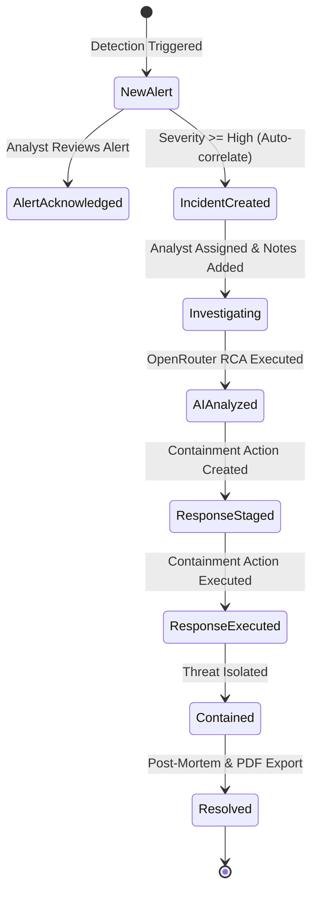
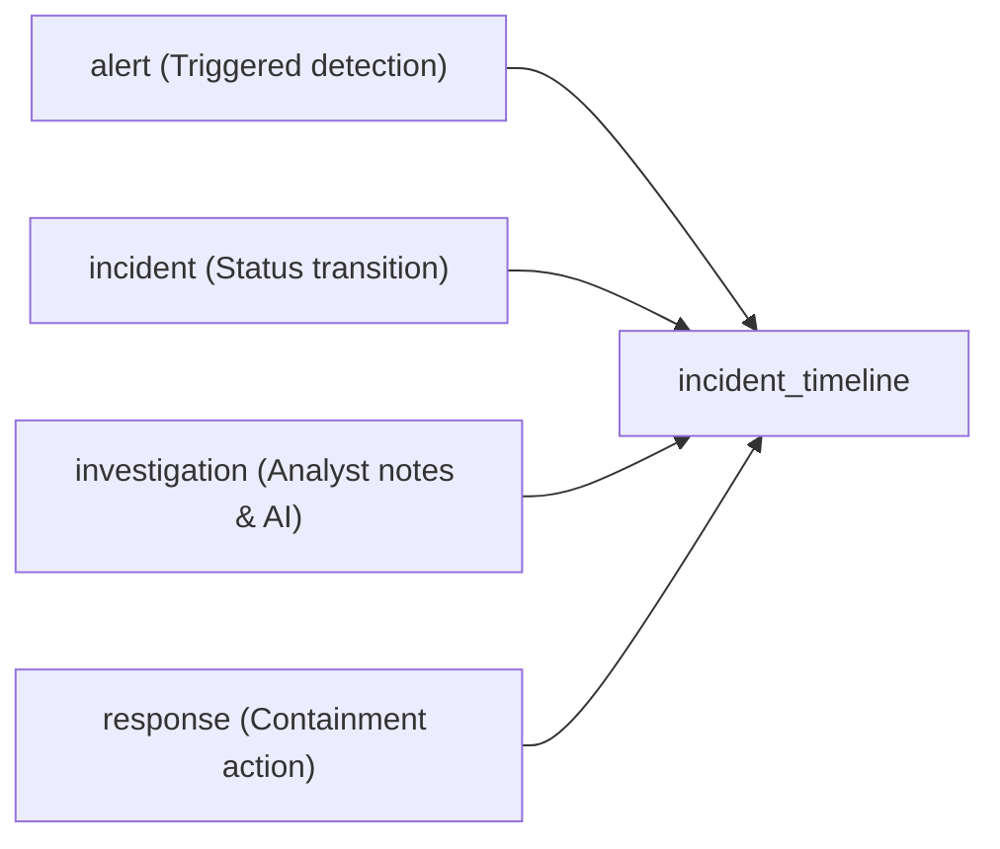

# SentinelX — Incident Lifecycle Diagram

## 1. Case State Machine & Timeline Milestones

```mermaid
stateDiagram-v2
    [*] --> NewAlert: Detection Triggered
    NewAlert --> AlertAcknowledged: Analyst Reviews Alert
    NewAlert --> IncidentCreated: Severity >= High (Auto-correlate)

    IncidentCreated --> Investigating: Analyst Assigned & Notes Added
    Investigating --> AIAnalyzed: OpenRouter RCA Executed
    AIAnalyzed --> ResponseStaged: Containment Action Created
    ResponseStaged --> ResponseExecuted: Containment Action Executed
    ResponseExecuted --> Contained: Threat Isolated
    Contained --> Resolved: Post-Mortem & PDF Export
    Resolved --> [*]
```

---

## 2. Timeline Event Types

```mermaid
flowchart LR
    E1["alert (Triggered detection)"] --> T[incident_timeline]
    E2["incident (Status transition)"] --> T
    E3["investigation (Analyst notes & AI)"] --> T
    E4["response (Containment action)"] --> T
```
