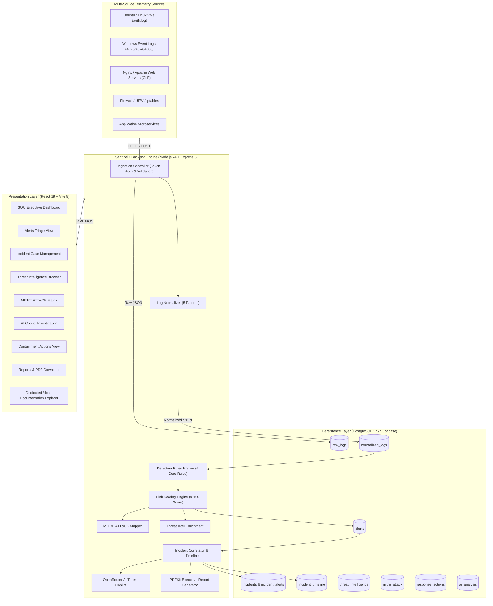

# SentinelX — System Architecture Diagram

## 1. High-Level Modular Architecture

```mermaid
flowchart TD
    subgraph Telemetry["Multi-Source Telemetry Sources"]
        U["Ubuntu / Linux VMs (auth.log)"]
        W["Windows Event Logs (4625/4624/4688)"]
        N["Nginx / Apache Web Servers (CLF)"]
        F["Firewall / UFW / iptables"]
        A["Application Microservices"]
    end

    subgraph Backend["SentinelX Backend Engine (Node.js 24 + Express 5)"]
        ING["Ingestion Controller (Token Auth & Validation)"]
        NORM["Log Normalizer (5 Parsers)"]
        DET["Detection Rules Engine (6 Core Rules)"]
        RISK["Risk Scoring Engine (0-100 Score)"]
        MITRE["MITRE ATT&CK Mapper"]
        TI["Threat Intel Enrichment"]
        INC["Incident Correlator & Timeline"]
        AI_COPILOT["OpenRouter AI Threat Copilot"]
        PDF["PDFKit Executive Report Generator"]
    end

    subgraph Storage["Persistence Layer (PostgreSQL 17 / Supabase)"]
        DB_RAW[("raw_logs")]
        DB_NORM[("normalized_logs")]
        DB_ALERTS[("alerts")]
        DB_INC[("incidents & incident_alerts")]
        DB_TIME[("incident_timeline")]
        DB_TI[("threat_intelligence")]
        DB_MITRE[("mitre_attack")]
        DB_RESP[("response_actions")]
        DB_AI[("ai_analysis")]
    end

    subgraph Frontend["Presentation Layer (React 19 + Vite 8)"]
        UI_DASH["SOC Executive Dashboard"]
        UI_ALERTS["Alerts Triage View"]
        UI_INC["Incident Case Management"]
        UI_TI["Threat Intelligence Browser"]
        UI_MITRE["MITRE ATT&CK Matrix"]
        UI_AI["AI Copilot Investigation"]
        UI_RESP["Containment Actions View"]
        UI_REP["Reports & PDF Download"]
        UI_DOCS["Dedicated /docs Documentation Explorer"]
    end

    Telemetry -->|HTTPS POST| ING
    ING -->|Raw JSON| DB_RAW
    ING --> NORM
    NORM -->|Normalized Struct| DB_NORM
    DB_NORM --> DET
    DET --> RISK
    RISK --> MITRE
    RISK --> TI
    RISK --> DB_ALERTS
    DB_ALERTS --> INC
    INC --> DB_INC
    INC --> DB_TIME
    INC --> AI_COPILOT
    INC --> PDF

    Backend <-->|REST API JSON| Frontend
```
