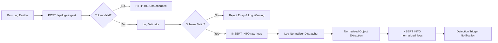

# SentinelX — Ingestion Pipeline Architecture

## 1. Flow Diagram

---

## 2. Ingestion Resilience

- **Fail-Safe Processing**: If an array of 50 logs contains 2 malformed entries, the 48 valid logs are processed and inserted, while the 2 malformed items are isolated into a `rejected` report without interrupting the transaction.
- **Backpressure & Limits**: Request body size limit set to 5 MB (`app.use(express.json({ limit: "5mb" }))`).
